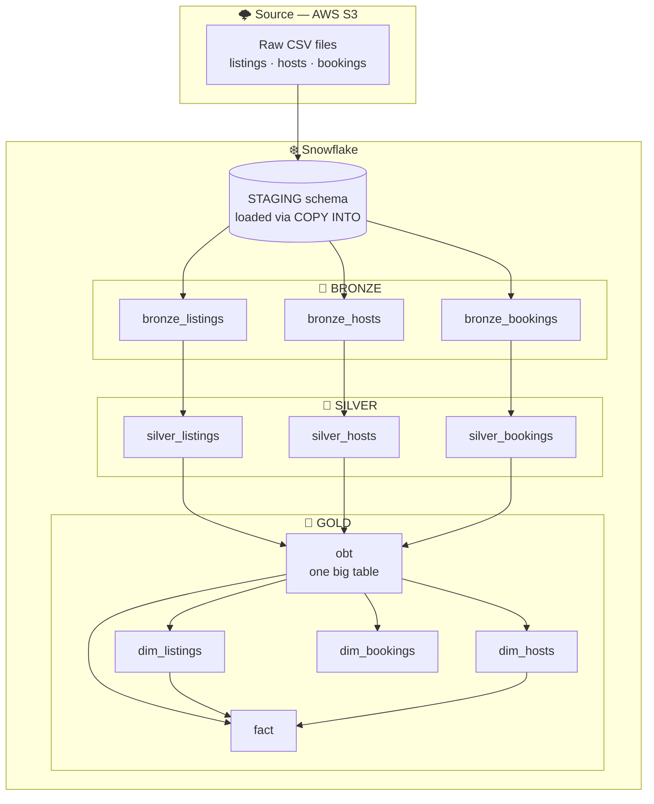

# 🏠 Airbnb Analytics Pipeline — AWS · dbt · Snowflake

> An end-to-end **ELT pipeline** that transforms raw Airbnb data into analytics-ready models using the **Medallion Architecture** (Bronze → Silver → Gold) on **Snowflake**, orchestrated and tested with **dbt**.


---

## 📖 Overview

This project demonstrates a modern data-stack workflow: raw Airbnb data lands in **AWS S3**, is loaded into a Snowflake `STAGING` schema, and is then progressively refined through three modeling layers using dbt.

The pipeline showcases a range of production-grade analytics-engineering patterns:

- **Medallion architecture** — clean separation of raw, cleaned, and business-ready data
- **Incremental models** with watermark logic to process only new records
- **Slowly Changing Dimensions (SCD Type 2)** via dbt snapshots to track history
- **Reusable Jinja macros** for DRY, consistent transformations
- **Config-driven dynamic SQL** — joins generated from metadata via Jinja loops
- **One Big Table (OBT)** plus a **star-schema fact** table for flexible analytics

---

## 🏗️ Architecture



| Layer | Schema | Purpose | Materialization |
|-------|--------|---------|-----------------|
| 🥉 **Bronze** | `bronze` | Raw, faithful ingestion from staging with incremental loads | Incremental |
| 🥈 **Silver** | `silver` | Cleaned, typed, and enriched (derived columns, standardized values) | Table / Incremental |
| 🥇 **Gold** | `gold` | Business-ready models — OBT, SCD2 dimensions, and a fact table | Table / Ephemeral / Snapshot |

> 💡 A custom `generate_schema_name` macro writes models to clean, environment-agnostic schemas (`bronze`, `silver`, `gold`) instead of dbt's default `<target>_<custom>` naming.

---

## 🛠️ Tech Stack

| Tool | Role |
|------|------|
| ❄️ **Snowflake** | Cloud data warehouse |
| 🔧 **dbt Core 1.11** | Transformation, testing & orchestration (ELT) |
| ☁️ **AWS S3** | Raw data landing zone |
| 🐍 **Python 3.12** | Runtime |
| 📦 **uv** | Fast dependency & environment management |

---

## 🗃️ Data Sources

Raw data is staged in `AIRBNB.STAGING` (defined in `models/sources/sources.yml`) across three tables:

**`listings`**

| Column | Description |
|--------|-------------|
| `listing_id` | Unique listing identifier |
| `host_id` | FK to the host |
| `property_type`, `room_type` | Property classification |
| `city`, `country` | Location |
| `bedrooms`, `bathrooms`, `accommodates` | Capacity attributes |
| `price_per_night` | Nightly price |
| `created_at` | Record timestamp (used as incremental watermark) |

**`hosts`**

| Column | Description |
|--------|-------------|
| `host_id` | Unique host identifier |
| `host_name` | Host display name |
| `host_since` | Date the host joined |
| `is_superhost` | Superhost flag |
| `response_rate` | Host response rate (%) |
| `created_at` | Record timestamp |

**`bookings`**

| Column | Description |
|--------|-------------|
| `booking_id` | Unique booking identifier |
| `listing_id` | FK to the listing |
| `booking_date` | Date of booking |
| `nights_booked` | Number of nights |
| `booking_amount`, `cleaning_fee`, `service_fee` | Cost components |
| `booking_status` | Booking state |
| `created_at` | Record timestamp |

---

## 📂 Project Structure

```
AWS_DBT_Snowflake/
├── aws_dbt_snowflake_project/          # dbt project root
│   ├── models/
│   │   ├── sources/
│   │   │   └── sources.yml             # staging source definitions
│   │   ├── bronze/                     # raw incremental ingestion
│   │   │   ├── bronze_listings.sql
│   │   │   ├── bronze_hosts.sql
│   │   │   └── bronze_bookings.sql
│   │   ├── silver/                     # cleaned & conformed
│   │   │   ├── silver_listings.sql
│   │   │   ├── silver_hosts.sql
│   │   │   └── silver_bookings.sql
│   │   └── gold/                       # analytics-ready
│   │       ├── ephemeral/              # lightweight intermediate logic
│   │       │   ├── listings.sql
│   │       │   ├── hosts.sql
│   │       │   └── bookings.sql
│   │       ├── obt.sql                 # one big table
│   │       └── fact.sql                # star-schema fact
│   ├── snapshots/                      # SCD2 dimensions
│   │   ├── dim_listings.yml
│   │   ├── dim_hosts.yml
│   │   └── dim_bookings.yml
│   ├── macros/
│   │   ├── generate_schema_name.sql    # clean bronze/silver/gold schemas
│   │   ├── multiply.sql                # rounded multiplication helper
│   │   └── tag.sql                     # price bucketing helper
│   ├── analyses/
│   ├── seeds/
│   ├── tests/
│   ├── dbt_project.yml
│   └── profiles.yml                    # template — keep real secrets out of git
├── main.py
├── pyproject.toml                      # Python deps (dbt-core, dbt-snowflake)
├── .python-version                     # 3.12
└── README.md
```

---

## 🧱 Data Modeling Layers

### 🥉 Bronze — Raw Ingestion

Incremental `select *` from each staging source. On every run, only rows newer than the latest `created_at` already loaded are appended:

```sql

  where created_at > (select coalesce(max(created_at), '1900-01-01') from {{ this }})

```

### 🥈 Silver — Cleaned & Enriched

- **`silver_listings`** — selects and orders key columns and adds a `price_per_night_tag` (low / medium / high) via the `tag()` macro.
- **`silver_hosts`** — standardizes `host_name`, and derives a `response_rate_quality` band (`VERY_GOOD` / `GOOD` / `FAIR` / `POOR`) from `response_rate`.
- **`silver_bookings`** — computes `total_amount` using the `multiply()` macro plus cleaning and service fees.

### 🥇 Gold — Business-Ready

- **`obt`** — a denormalized **One Big Table** joining bookings, listings, and hosts. The joins are generated dynamically from a list of config objects looped in Jinja.
- **Ephemeral models** (`gold/ephemeral/*`) — inlined CTEs that slice the OBT into listing, host, and booking grains feeding the snapshots.
- **`fact`** — a star-schema fact assembled from the OBT and the dimension snapshots.

---

## 📸 Snapshots (SCD Type 2)

The `snapshots/` directory captures historical change on the listing, host, and booking dimensions using dbt's **timestamp** strategy:

```yaml
snapshots:
  - name: dim_listings
    relation: ref('listings')
    config:
      schema: gold
      unique_key: LISTING_ID
      strategy: timestamp
      updated_at: LISTING_CREATED_AT
```

dbt automatically maintains `dbt_valid_from` / `dbt_valid_to` columns so you can query the state of any dimension at any point in time.

---

## 🧩 Reusable Macros

| Macro | Purpose |
|-------|---------|
| `generate_schema_name` | Routes models to clean `bronze` / `silver` / `gold` schemas |
| `multiply(x, y, precision)` | `round(x * y, precision)` — used for booking totals |
| `tag(col)` | Buckets `price_per_night` into `low` / `medium` / `high` |

---

## 🚀 Getting Started

### Prerequisites

- Python **3.11+** (3.12 recommended)
- [`uv`](https://docs.astral.sh/uv/) installed
- A **Snowflake** account with a `AIRBNB` database and a `COMPUTE_WH` warehouse
- Raw data staged in Snowflake's `STAGING` schema (loaded from AWS S3 via `COPY INTO` or Snowpipe)

### Installation

```bash
# Clone the repository
git clone https://github.com/Balaprathap/AWS_DBT_Snowflake.git
cd AWS_DBT_Snowflake

# Install dependencies (dbt-core + dbt-snowflake) into a virtual env
uv sync
```

### Configuration

Create a dbt profile at `~/.dbt/profiles.yml` (keep real credentials out of the repo):

```yaml
aws_dbt_snowflake_project:
  target: dev
  outputs:
    dev:
      type: snowflake
      account: <your_account_identifier>
      user: <your_username>
      password: <your_password>      # or use key-pair / SSO authentication
      role: TRANSFORMER              # a least-privilege role (avoid ACCOUNTADMIN)
      database: AIRBNB
      warehouse: COMPUTE_WH
      schema: dbt_schema             # base schema; models route to bronze/silver/gold
      threads: 4
```

---

## ▶️ Running the Pipeline

All dbt commands run from the project directory:

```bash
cd aws_dbt_snowflake_project

# 1. Verify the connection
uv run dbt debug

# 2. Build the layers in order
uv run dbt run --select bronze     # raw incremental loads
uv run dbt run --select silver     # cleaned & conformed
uv run dbt run --select obt        # gold: one big table

# 3. Capture history with SCD2 snapshots
uv run dbt snapshot                # builds dim_listings, dim_hosts, dim_bookings

# 4. Build the fact table
uv run dbt run --select fact

# 5. Run tests
uv run dbt test
```

> Tip: once you're set up, `uv run dbt build` will run models, snapshots, and tests together in dependency order.

---

## 🔮 Future Enhancements

- ✅ Add column-level **data tests** (`unique`, `not_null`, `relationships`) on keys in a `schema.yml`
- 📚 Publish **dbt docs** with the auto-generated lineage graph (`dbt docs generate && dbt docs serve`)
- 🔁 Automate runs with a **CI/CD pipeline** (GitHub Actions) on every push
- 🛰️ Productionize ingestion with **Snowpipe** for continuous S3 → Snowflake loading
- 📊 Connect a BI layer (Power BI / Tableau) and define dbt **exposures**
- 📈 Add **source freshness** checks and incremental tests

---

## 👤 Author

**BalaPrathap Chellakkannu**
🔗 GitHub: [@Balaprathap](https://github.com/Balaprathap)
💼 LinkedIn: https://www.linkedin.com/in/balaprathap-chellakkannu/
---

## 📄 License

Released under the **MIT License** — feel free to use this project as a reference. _(Add a `LICENSE` file to formalize.)_
